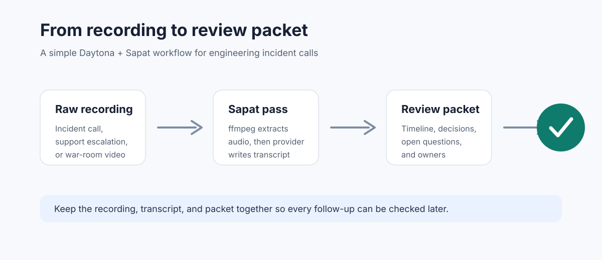

# Turn Incident Recordings into Review Packets

# Introduction

Most engineering teams record incident calls, outage reviews, customer escalations, or architecture walkthroughs.
The recording is useful, but only if someone turns it into something the team can actually read.
A two-hour video sitting in a shared folder does not help the next on-call engineer understand what happened at 2 a.m.

This guide shows a practical way to use [Sapat](https://github.com/nkkko/sapat) inside a Daytona workspace to turn incident recordings into review packets.
Sapat handles the first rough pass: it converts video to MP3, sends the audio to OpenAI, Groq, or Azure OpenAI for transcription, and writes a `.txt` file next to the original recording.
From there, we add a small, repeatable review workflow around the transcript so the final output is more than a wall of text.

The goal is not to automate judgment. People still decide what the root cause was, what trade-offs were made, and what needs to change. The point is to remove the dull parts: setup drift, one-off scripts, missing transcripts, scattered notes, and forgotten follow-ups.

## TL;DR

- Create a Daytona workspace from the Sapat repository so transcription work happens in a clean environment.
- Configure one provider: OpenAI, Groq, or Azure OpenAI.
- Run Sapat against a single recording or a directory of incident videos.
- Turn each transcript into a review packet with timeline, decisions, open questions, and action items.
- Keep the raw recording, transcript, and packet together so future reviews are easy to audit.



## What You Will Build

By the end, your workspace will have a simple structure:

```text
incident-review/
  raw/
    checkout-outage-2026-05-17.mp4
  transcripts/
    checkout-outage-2026-05-17.txt
  packets/
    checkout-outage-2026-05-17-review.md
  README.md
```

The transcript is produced by Sapat. The packet is the human-readable artifact your team can use in a post-incident review, sprint retro, or handoff.

This works well for:

- production incidents
- support escalations
- architecture review calls
- release war rooms
- vendor troubleshooting sessions
- internal demos where decisions were made live

It is less useful for recordings where the audio is poor, speakers overlap constantly, or the team needs legally certified transcription. In those cases, use this as a draft only.

## Set Up the Daytona Workspace

Start with a clean workspace from the Sapat repository:

```bash
daytona create https://github.com/nkkko/sapat --code
```

Install the package requirements:

```bash
pip install -r requirements.txt
```

Sapat depends on `ffmpeg` for audio extraction. Check that it is available:

```bash
ffmpeg -version
```

If the command is missing, install `ffmpeg` in the workspace before transcribing. The exact command depends on the base image used by your workspace, but Debian and Ubuntu based environments usually use:

```bash
sudo apt-get update
sudo apt-get install -y ffmpeg
```

Keep this setup inside Daytona rather than on your laptop. Incident recordings often come from different systems, and local machine setup tends to drift. A reproducible workspace gives the team one place to rerun the process when a transcript needs to be regenerated.

## Choose One Transcription Provider

Sapat supports three provider modes:

- `--api openai`
- `--api groq`
- `--api azure`

Pick one for the first run. Do not configure all three unless you actually need to compare them.

For OpenAI, add this to `.env`:

```bash
OPENAI_API_KEY=your_openai_api_key
OPENAI_MODEL=whisper-1
OPENAI_API_ENDPOINT=https://api.openai.com/v1/audio/transcriptions
OPENAI_MODEL_NAME_CHAT=gpt-4o
```

For Groq, add:

```bash
GROQCLOUD_API_KEY=your_groq_api_key
GROQCLOUD_MODEL=whisper-large-v3-turbo
GROQCLOUD_API_ENDPOINT=https://api.groq.com/openai/v1/audio/transcriptions
GROQCLOUD_MODEL_NAME_CHAT=llama3-8b-8192
```

For Azure OpenAI, add:

```bash
AZURE_OPENAI_API_KEY=your_azure_api_key
AZURE_OPENAI_ENDPOINT=https://DEPLOYMENTENDPOINTNAME.openai.azure.com
AZURE_OPENAI_DEPLOYMENT_NAME_WHISPER=whisper
AZURE_OPENAI_API_VERSION_WHISPER=2024-06-01
AZURE_OPENAI_DEPLOYMENT_NAME_CHAT=gpt-4o
AZURE_OPENAI_API_VERSION_CHAT=2023-03-15-preview
```

Store `.env` in the workspace and keep it out of Git. Incident transcripts may include customer names, internal systems, and private decisions. Treat API keys and transcript output as sensitive.

## Prepare the Recording

Create a working folder:

```bash
mkdir -p incident-review/raw incident-review/transcripts incident-review/packets
```

Put the recording in `incident-review/raw/`. Use a name that will still make sense six months later:

```text
checkout-outage-2026-05-17.mp4
```

Good names usually include:

- system or product area
- incident type
- date
- optional region or customer if that matters internally

Avoid names like `zoom_0.mp4` or `recording-final-final.mp4`. You will regret those later.

## Run Sapat

Run Sapat on one recording:

```bash
sapat incident-review/raw/checkout-outage-2026-05-17.mp4 \
  --quality H \
  --language en \
  --api openai \
  --prompt "Engineering incident review call. Keep technical terms, service names, timestamps, and action item wording as accurately as possible." \
  --temperature 0
```

Sapat creates a `.txt` file with the same base name as the video. Move it into the transcript folder:

```bash
mv incident-review/raw/checkout-outage-2026-05-17.txt \
  incident-review/transcripts/checkout-outage-2026-05-17.txt
```

For a directory of recordings, Sapat can process all `.mp4` files in that directory:

```bash
sapat incident-review/raw --quality H --language en --api openai --temperature 0
```

Batch mode is useful for a week of customer calls or a folder of retro recordings. For a serious incident, start with one file. Read the output before processing everything else.

## Build the Review Packet

Create a packet file:

```bash
touch incident-review/packets/checkout-outage-2026-05-17-review.md
```

Use this structure:

```markdown
# Checkout Outage Review Packet

## Source

- Recording: `raw/checkout-outage-2026-05-17.mp4`
- Transcript: `transcripts/checkout-outage-2026-05-17.txt`
- Transcribed with: Sapat, OpenAI, high-quality audio extraction

## One-Paragraph Summary

Write the plain-language version of what happened.

## Timeline

| Time | Event | Evidence |
| --- | --- | --- |
| 00:04:21 | First report of checkout failures | Support mentions failed payments in EU |

## Decisions Made

- Decision:
- Who made it:
- Why:
- Trade-off:

## Open Questions

- Question:
- Owner:
- Needed by:

## Action Items

| Owner | Action | Due date | Status |
| --- | --- | --- | --- |
|  |  |  |  |

## Transcript Notes

- Terms that may have been misheard:
- Speaker labels that need cleanup:
- Sections worth re-listening to:
```

This packet is intentionally simple. If the format is too heavy, people stop using it. The transcript gives you raw detail; the packet gives you a clean review path.

## Review the Transcript Before Summarizing

Do one manual pass before writing the summary. Look for:

- service names that were transcribed incorrectly
- people names that should be removed or replaced with roles
- timestamps where the discussion changes topic
- clear decisions
- guessed root causes
- action items that sound like promises but have no owner
- private customer details that should not appear in the final packet

Do not blindly paste the transcript into another tool and ask for a summary. That is how teams end up with confident nonsense. Use the transcript as evidence, then make the packet yourself.

For longer calls, split the transcript into sections:

```text
00:00-10:00 detection and triage
10:00-25:00 mitigation options
25:00-40:00 rollback discussion
40:00-55:00 customer communication
55:00-70:00 follow-up actions
```

The section names do not need to be perfect. They just make the review faster.

## Add a Lightweight Quality Gate

Before sharing the packet, check three things:

| Check | Why it matters |
| --- | --- |
| Every action item has an owner | Ownerless work disappears |
| Every strong claim links back to transcript evidence | People can verify the review |
| Sensitive names and customer details are handled deliberately | Transcripts often contain more than teams realize |

This is where Daytona helps again. Keep the packet, transcript, and raw recording in one workspace so another reviewer can open the same files and verify the same evidence.

## Common Problems

### The Transcript Has Bad Technical Terms

Use the `--prompt` flag. Put service names, product names, and acronyms in the prompt:

```bash
--prompt "Incident call for Checkout API, Ledger Worker, Payment Gateway, and EU-WEST. Preserve service names and incident vocabulary."
```

This does not guarantee perfect transcription, but it usually helps with domain terms.

### The Recording Is Too Noisy

Try `--quality H` first. If the recording is still bad, create a short test clip and compare providers before running the whole file. Do not spend money transcribing a two-hour call if the first five minutes are unusable.

### The Call Has Multiple Languages

Set `--language` when most of the recording is in one language. If the call switches languages often, mark those sections in the packet and review them manually. Mixed-language incident calls are easy to misread.

### The Transcript Is Too Long to Review

Do not start by summarizing everything. First mark timestamps where the topic changes. Then fill the packet section by section. Long transcripts become manageable when the review has a shape.

## A Practical Review Workflow

Here is the full loop:

1. Create or reopen the Daytona workspace.
2. Put the incident recording in `incident-review/raw/`.
3. Run Sapat with one provider and a domain-specific prompt.
4. Move the transcript into `incident-review/transcripts/`.
5. Read the transcript once and mark topic changes.
6. Fill the review packet.
7. Remove or generalize sensitive details.
8. Share the packet with the incident owner for correction.
9. Commit the final packet to your internal incident repo or knowledge base.

The point is not to make the review fancy. The point is to make it repeatable. When every incident follows the same shape, the team spends less time reconstructing history and more time fixing the system.

## Conclusion

Sapat gives you the rough transcript. Daytona gives you a clean place to run the workflow. The review packet turns both into something your team can use.

For incident reviews, that last step matters most. A transcript is a record of what people said. A review packet is a working document: what happened, what the team decided, what is still unclear, and who owns the next move.

Start with one recording. Keep the folder structure boring. Check the transcript by hand. Then use the same workflow the next time an incident call turns into action items nobody wants to lose.

## References

- [Sapat GitHub repository](https://github.com/nkkko/sapat)
- [Daytona GitHub repository](https://github.com/daytonaio/daytona)
- [OpenAI audio transcription API](https://platform.openai.com/docs/guides/audio)
- [Groq Cloud speech-to-text docs](https://console.groq.com/docs/speech-to-text)
- [Azure OpenAI Whisper documentation](https://learn.microsoft.com/azure/ai-services/openai/whisper-quickstart)
